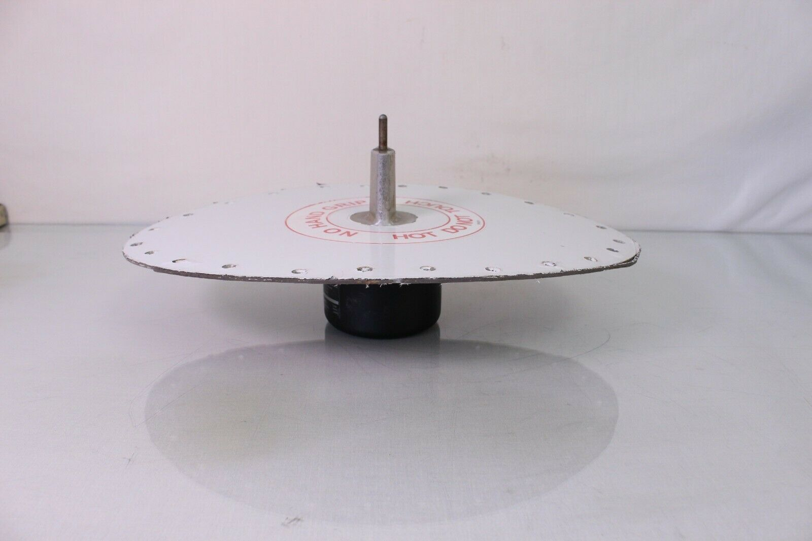
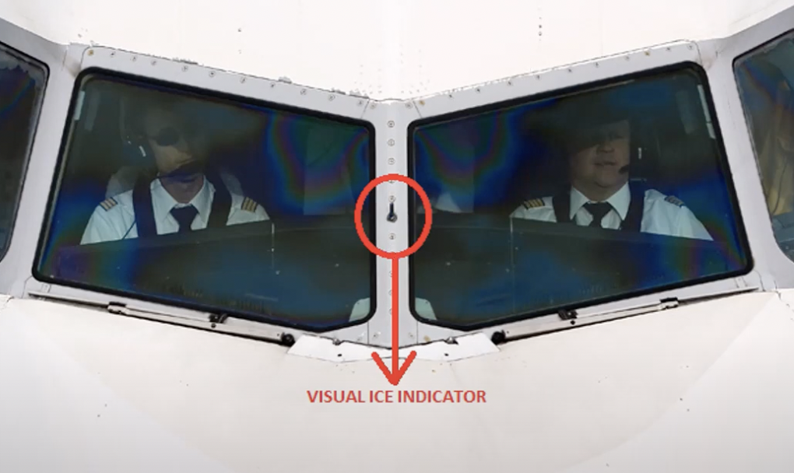

# Ice warning systems: Types, operation, and indications

## Learning Objectives

|                 | ATPL(A) | CPL(A) | ATPL(H)/IR | ATPL(H)/VFR | CPL(H) | IR  | CBIR(A) |
| --------------- | ------- | ------ | ---------- | ----------- | ------ | --- | ------- |
| 021.07.02.01.01 | X       | X      |            |             |        |     |         |
| 021.07.02.01.02 | X       | X      |            |             |        |     |         |

1. **021.07.02.01.01** -- Describe the different operating principles of the
   following ice detectors: mechanical systems using air pressure;
   electromechanical systems using resonance frequencies.
2. **021.07.02.01.02** -- Describe the principle of operation of ice warning
   systems.

## Summary

### Ice detection systems

#### Pressure differencial system

This device consists of 2 sets of holes facing the incoming air. One set
contains just one large hole, and the second set contains several small holes.
Summed all together, the small holes have the same area as the large hole.
Because of this, under normal conditions, the pressure measured from both sets
will be the same, that is, there is 0 pressure differential.

When Icing conditions are observed, the slow holes will close much faster than
the big hole, generating a pressure differential which can be measured. This
will trigger an ice warning light in the cockpit. Eventually, the big hole will
close as well, and the pressure differential will be 0. However, this will not
dismiss the alarm light.

When de-icing heating is turned on, the ice will melt much faster on the smaller
holes, causing, again a pressure differential, but with opposite direction. This
will cause the alarm light to be dismissed.

#### Smith's ice detector

This system uses a vane portruding into the airflow and 2 sets of wholes
destributed in front and in the back of the system. When icing conditions
occour, the front of the vane will freeze first, resulting in negative pressure
on the backside of the probe which triggers a warning light.

Remember, The smiths ice detector is activated by a **decrease in dynamic
pressure**!

#### Electromechanical systems using resonance frequencies (Rosemount ice detector)

This system consits of a vibrating detector. When there is no icing the detector
vibrates at a a fixed frequency. When ice starts to accumulate, increasing its
mass, and reducing the vibration frequency of the detector. This triggers the
warning light in the cockpit. A heater is provided for this system in order to
clear accumulated ice and reset the system.

#### Hot rod ice detector system

It consist of a rod placed outside the cockpit in a position that is easely
observable from the flight deck. This rod is usally colored matte black so that
ice it can be easily seen when it deposits. A heater is provided to heat the rod
and clear the ice.

### Operating principle of ice warning systems

#### Primary automatic

The ice detector automatically activates ice protection at the optimal moment.
This system provides pilots with a system status (active / inactive) and the
ability to manually override.

#### Primary Manual

The ice detector trigger a warning light, and the crew is responsible for
activating the ice protection system

#### Advisory

The flight crew is responsible for activating the ice protection device based on
recommendation of the flight manual. For example, most small aircraft POH's
recommend turning the pitot heat on when outside air temperature is less than
5ºC, regardless if icing conditions are observed or not. In this system, the ice
detector signals are an advisory back up indicator.

## Questions

<Question
  id="gjpGbSOEfW"
  lo="021.07.02.01.01"
  explanation="#pressure-differential-system"
>
  <Text variant="oneCorrect">
    Which Of these Statements is true regarding differential pressure ice
    accretion detector?
  </Text>
  <Text variant="multipleCorrect" select={5}>
    Which Of these Statements are true regarding differential pressure ice
    accretion detector?
  </Text>
  <Text variant="oneTwo">
    Which Of these Statements are true regarding differential pressure ice
    accretion detector?
  </Text>
  <Option id="gjpGbSOEfW-1">Large holes freeze first</Option>
  <Option id="gjpGbSOEfW-2" correct>
    Small holes freeze first
  </Option>
  <Option id="gjpGbSOEfW-3" correct>
    Small holes melt first
  </Option>
  <Option id="gjpGbSOEfW-4">Small holes are heated first</Option>
  <Option id="gjpGbSOEfW-5">
    Small and big holes are heated at the same time
  </Option>
  <Option id="gjpGbSOEfW-6" correct>
    An alarm light is activated in the cockpit when a pressure difference is
    measured between small and big apertures
  </Option>
  <Option id="gjpGbSOEfW-7">large holes melt first</Option>
  <Option id="gjpGbSOEfW-8">
    The torque of a rotating serrated shat is measured
  </Option>
  <Option id="gjpGbSOEfW-9">
    It is based on the measurement of temperature and moisture
  </Option>
</Question>

<Question
  id="h99GybgwTg"
  lo="021.07.02.01.01"
  explanation="#smiths-ice-detector"
>
  <Text variant="oneCorrect">What is measured by a Smith ice detector?</Text>
  <Option id="h99GybgwTg-1">Decrease in static pressure</Option>
  <Option id="h99GybgwTg-2">Increase in static pressure</Option>
  <Option id="h99GybgwTg-3" correct>
    Decrease in dynamic pressure
  </Option>
  <Option id="h99GybgwTg-4">Increase in dynamic pressure</Option>
</Question>

<Question id="jdDz5F9wY4" lo="021.07.02.01.01">
  <Text variant="oneCorrect">
    What best describes a <Subject />?
  </Text>
  <Option id="jdDz5F9wY4-1" subject="Pressure differential system">
    The total pressure measured at set of small holes is compared against one
    large hole of equal area. When icing conditions are observed, a pressure
    differential between the 2 sets can be measured.
  </Option>
  <Option id="jdDz5F9wY4-2" subject="Smith ice detector">
    A vane portudring to the airflow has holes in front and the back. When icing
    conditions are observed, the holes in front of the vane become blocked
    resulting in a pressure deferencial which can be measured.
  </Option>
  <Option id="jdDz5F9wY4-3" subject="Rosemount ice detector">
    A vibrating rod is placed onto the incoming airflow. When icing conditions
    are observed the vibration frequency is reduced resulting in an alarm light
    in the cockpit
  </Option>
  <Option id="jdDz5F9wY4-4" subject="Hot rod ice detector">
    A rod is installed in a position easily visible from the cokpit and provided
    with a flood light. Flight deck crew can use it to visually observe the
    accumulation of ice.
  </Option>
</Question>

<Question
  id="hN28OqaBTO"
  lo="021.07.02.01.02"
  explanation="### Ice detection systems"
>
  <Text variant="oneCorrect">
    How does the <Subject /> ice detection system operate?
  </Text>
  <Option id="hN28OqaBTO-1" subject="advisory">
    The flight crew activates the ice protection system based on Flight manual
    recommendations, such as outside air temperature, and moisture. The ice
    detector signals serve as a backup indicator
  </Option>
  <Option id="hN28OqaBTO-2" subject="primary manual">
    The flight crew activates the ice protection system based on the ice
    detector signals
  </Option>
  <Option id="hN28OqaBTO-3" subject="primary automatic">
    The ice protection system is activated automatically based on the ice
    detector signal. A manual override is available to the cabin crew.
  </Option>
  <Option id="hN28OqaBTO-4">
    The ice protection system is activated automatically based on the ice
    detector signal. A manual override is not possible
  </Option>
  <Option id="hN28OqaBTO-5" subject="primary manual">
    All ice detection systems are used to alert the cockpit crew, and ice
    protection systems are always activated manually.
  </Option>
</Question>
