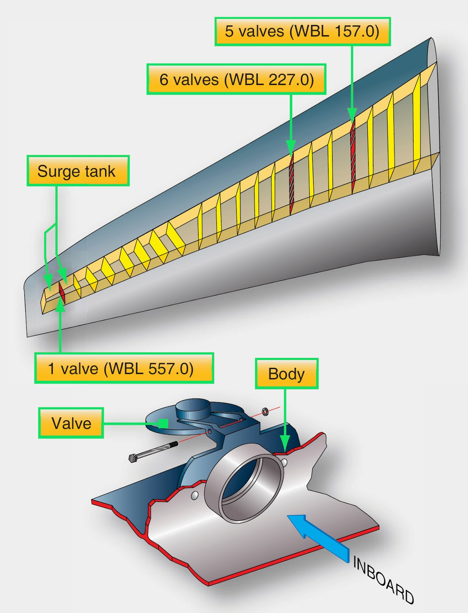

# Design, operation, system components, indications

## Learning Objectives

1. **021.08.02.02.01** -- Explain the function of the fuel system: lines;
   centrifugal boost pump; pressure valves; fuel shut-off valve; filter,
   strainer; tanks (wing, tip, fuselage, tail); bafflers/baffles; sump; vent
   system; drain; fuel-quantity sensor; fuel-temperature sensor;
   refuelling/defueling system; fuel dump/jettison system.
2. **021.08.02.02.02** -- Name the main components of the fuel system and state
   their location and their function: trim fuel tanks; bafflers;
   refuelling/defueling system; fuel dump/jettison system. Remark: For
   completion of list, please see 021.08 01.02 (02..
3. **021.08.02.02.03** -- Interpret a typical fuel system schematic to the level
   of detail as found in an aircraft FCOM.
4. **021.08.02.02.04** -- Explain the limitations in the event of loss of
   booster pump fuel pressure.
5. **021.08.02.02.05** -- Describe the use and purpose of drip sticks (manual
   magnetic indicators) (may also be known as dip stick or drop stick).
6. **021.08.02.02.06** -- Explain the considerations for fitting a fuel
   dump/jettison system and, if fitted, its function.

|                 | ATPL(A) | CPL(A) | ATPL(H)/IR | ATPL(H)/VFR | CPL(H) | IR  | CBIR(A) |
| --------------- | ------- | ------ | ---------- | ----------- | ------ | --- | ------- |
| 021.08.02.02.01 | X       | X      | X          | X           | X      |     |         |
| 021.08.02.02.02 | X       | X      | X          | X           | X      |     |         |
| 021.08.02.02.03 | X       | X      | X          | X           | X      |     |         |
| 021.08.02.02.04 | X       | X      | X          | X           | X      |     |         |
| 021.08.02.02.05 | X       | X      |            |             |        |     |         |
| 021.08.02.02.06 | X       | X      | X          | X           | X      |     |         |

## Summary

### Baffles and Baffle valves

- Baffles - Dampen the fuel movement
- Baffle valves - PRevent outward movement of flow (from the wing root to the
  tip)

<Source
  href="https://www.faa.gov/regulations_policies/handbooks_manuals/aviation/"
  alt="FAA H-8083-31"
/>

### Dip sticks

The quantity of fuel is determined by using measurements from the dip stick and
data tables in the aircraft documentation.

## Questions

<Question
  id="NoE78czeBf"
  variant="definition"
  lo="021.08.02.02.01"
  explanation="#baffles-and-baffle-valves"
>
  <Text>
    The purpose of <Subject /> in wing fuel tanks is to...
  </Text>
  <Option id="NoE78czeBf-1" subject="baffles">
    Dampen the movement of fuel inside the tank
  </Option>
  <Option
    id="NoE78czeBf-1"
    subject="baffles"
    why="restrict as in 'make harder', not as in 'make impossible'."
  >
    Restrict fuel movement in the tank
  </Option>
  <Option id="NoE78czeBf-2" subject={["baffle valves", "baffle check valves"]}>
    Prevent fuel movement to the wing tips
  </Option>
  <Option id="NoE78czeBf-3">Close the vent lines in case of turbulence</Option>
  <Option id="NoE78czeBf-4">Prevent positive buildup inside the tank</Option>
  <Option id="NoE78czeBf-5">
    Limit high fuel flow during refuelling operations
  </Option>
</Question>

<Question id="omECWfTeNs" variant="oneCorrect" lo="021.08.02.02.01">
  <Text>
    The operating pressure of a booster pump in a fuel supply system of a gas
    turbine aircraft is...
  </Text>
  <Option id="omECWfTeNs-1" correct>
    20 to 100 PSI
  </Option>
  <Option id="omECWfTeNs-2">5 to 20 PSI</Option>
  <Option id="omECWfTeNs-3">1 to 5 PSI</Option>
  <Option id="omECWfTeNs-4">100 to 300 PSI</Option>
</Question>

<Question
  id="3kx6xVm1Wh"
  variant="oneCorrect"
  lo="021.08.02.02.05"
  explanation="#dip-sticks"
>
  <Text>
    The quantity of fuel measure by a dip stick is determined using...
  </Text>
  <Option id="3kx6xVm1Wh-1" correct>
    measurements from the dip stick and data tables in the aircraft
    documentation
  </Option>
  <Option
    id="3kx6xVm1Wh-2"
    why="although this is commonly done in small aircraft, it's too unreliable for large aircraft with significant temperature operational ranges"
  >
    measurements alone
  </Option>
  <Option id="3kx6xVm1Wh-3">
    measurements from the dipstick and the fuel's specific gravity.
  </Option>
  <Option id="3kx6xVm1Wh-4">
    measurements from the dipstick and the current OAT.
  </Option>
</Question>
