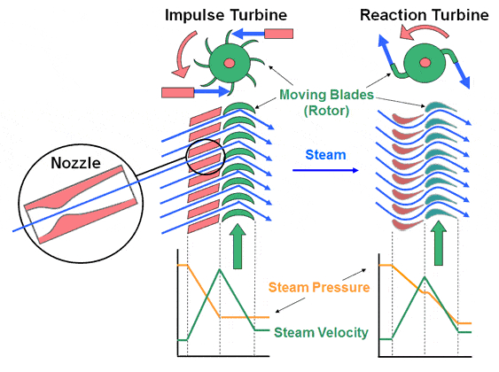
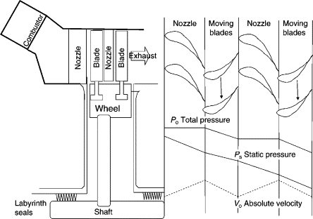

# Turbine

## Learning Objectives

1. **021.11.02.04.01** -- Explain the purpose of a turbine in different types of
   gas turbine engines.
2. **021.11.02.04.02** -- Describe the principles of operation of impulse,
   reaction and impulse-reaction axial flow turbines.
3. **021.11.02.04.03** -- Name the main components of a turbine stage and their
   function.
4. **021.11.02.04.04** -- Describe the working principle of a turbine.
5. **021.11.02.04.05** -- Describe the gas-parameter changes in a turbine stage.
6. **021.11.02.04.06** -- Describe the function and the working principle of
   active clearance control.
7. **021.11.02.04.07** -- Describe the implications of tip losses and the means
   to minimise them.
8. **021.11.02.04.08** -- Explain why the available engine thrust is limited by
   the turbine inlet temperature.
9. **021.11.02.04.09** -- Explain the divergent gas-flow annulus through an
   axial-flow turbine.
10. **021.11.02.04.10** -- Explain the high mechanical thermal stress in the
    turbine blades and wheels/discs.

|                 | ATPL(A) | CPL(A) | ATPL(H)/IR | ATPL(H)/VFR | CPL(H) | IR  | CBIR(A) |
| --------------- | ------- | ------ | ---------- | ----------- | ------ | --- | ------- |
| 021.11.02.04.01 | X       | X      | X          | X           | X      |     |         |
| 021.11.02.04.02 | X       | X      | X          | X           | X      |     |         |
| 021.11.02.04.03 | X       | X      | X          | X           | X      |     |         |
| 021.11.02.04.04 | X       | X      | X          | X           | X      |     |         |
| 021.11.02.04.05 | X       | X      | X          | X           | X      |     |         |
| 021.11.02.04.06 | X       | X      |            |             |        |     |         |
| 021.11.02.04.07 | X       | X      | X          | X           | X      |     |         |
| 021.11.02.04.08 | X       | X      |            |             |        |     |         |
| 021.11.02.04.09 | X       | X      | X          | X           | X      |     |         |
| 021.11.02.04.10 | X       | X      | X          | X           | X      |     |         |

## Summary

### Impulse and Reaction turbines

The idea behind a turbine is to extract energy from the incoming flow to convert
it into rotation of a turbine wheel. In principle, there are two ways to achieve
this.

#### Impulse turbine

In an impulse turbine, the basic idea is to have the incoming jet of air strike
the rotor blades, causing them to move. This process extracts kinetic energy
from the incoming airflow and as such results in a velocity drop of the flow in
the rotor. Pressure on the other hand, remains constant in this process.

The guiding vanes in an impulse turbine are used to optimize flow direction so
as to strike the rotor blades at the optimal position. They are also used to
accelerate the flow by converting potential energy into kinetic energy,
resulting in a pressure decrease, and a velocity increase.

#### Reaction turbine

In a reaction turbine, the disk is rotated as a consequence of the aerodynamic
action of the air passing through the rotor blades. Rotor blades are shaped like
aerofoils and function very much like one. As the flow develops around an
aerofoil. flow velocity as a tendency to increase and pressure decreases.
However, contrary to a normal aerofoil a rotor blade absorbs energy when it
rotates, resulting in a decrease of the total energy between the inlet and
outlet. This result in a decrease of absolute flow velocity between the inlet
and outlet of the rotor disk.

Nozzle guide vanes in a reaction turbine are also shaped like aerofoils, but as
no energy is absorbed, we observe a pure exchange of kinetic and potential
energy: Total Energy remains constant, but pressure decreases and velocity
increases.

#### In summary

- P - Flow static Pressure
- T - Flow static Temperature
- V - Flow velocity
- E - Flow total energy - Kinetic Energy (from its velocity) + Potential Energy
  (from its pressure)

|                     | Impulse Turbine | Reaction Turbine |
| ------------------- | --------------- | ---------------- |
| P/T at Stator Vanes | Decreases       | Decreases        |
| V at Stator Vanes   | Increases       | Increases        |
| E at Stator Vanes   | Constant        | Constant         |
|                     |                 |                  |
| P/T at Rotor blades | Constant        | Decreases        |
| V at Rotor blades   | Decreases       | Decreases        |
| E at Rotor blades   | Decreases       | Decreases        |

**Remember**:

- Pressure and Temperature both represent potential energy of the flow and as
  such follow the same pattern.
- Total energy remains constant In stator stages, and decreases in rotor stages
  as energy is absorbed.
- In stator stages the flows is redirected and/or constricted resulting in an
  exchange of potential for kinetic energy
- In rotor stages energy is absorbed resulting in a net less of kinetic +
  potential energy.
- In an impulse type turbine, at the rotor only kinetic energy is absorbed.
  Pressure remains constant and velocity decreases.
- In an reaction type turbine, at the rotor both kinetic and potential energy
  are absorbed. Both Pressure and Velocity decrease.

## Questions

<Question
  id="xU53cc6tQ4"
  variant="definition"
  lo={["021.11.02.04.02"]}
  explanation="### Impulse and Reaction turbines"
>
  <Text variant="oneCorrect">
    Which of these statements is correct regarding a <Subject /> turbine?
  </Text>
  <Text variant="oneTwo">
    Which of these statements are correct regarding a <Subject /> turbine?
  </Text>
  <Text variant="multipleCorrect" select={5}>
    Which of these statements are correct regarding a <Subject /> turbine?
  </Text>
  <Option key="1" id="xU53cc6tQ4-1" subject={["impulse", "reaction"]}>
    The pressure drops across Nozzle guide vanes
  </Option>
  <Option key="1" id="xU53cc6tQ4-2" subject={["impulse", "reaction"]}>
    The temperature drops across Nozzle guide vanes
  </Option>
  <Option key="1" id="xU53cc6tQ4-3" subject={["impulse", "reaction"]}>
    The flow velocity increases across Nozzle guide vanes
  </Option>
  <Option key="1" id="xU53cc6tQ4-4" subject={["impulse", "reaction"]}>
    The total energy remains constant across Nozzle guide vanes
  </Option>
  <Option key="1" id="xU53cc6tQ4-5">
    The pressure increases across Nozzle guide vanes
  </Option>
  <Option key="1" id="xU53cc6tQ4-6">
    The pressure remains constant across Nozzle guide vanes
  </Option>
  <Option key="1" id="xU53cc6tQ4-7">
    The temperature increases across Nozzle guide vanes
  </Option>
  <Option key="1" id="xU53cc6tQ4-8">
    The temperature remains constant across Nozzle guide vanes
  </Option>
  <Option key="1" id="xU53cc6tQ4-9">
    The flow velocity drops across Nozzle guide vanes
  </Option>
  <Option key="1" id="xU53cc6tQ4-a">
    The flow velocity remains constant across Nozzle guide vanes
  </Option>
  <Option key="1" id="xU53cc6tQ4-b">
    The total energy decreases across Nozzle guide vanes
  </Option>
  <Option key="1" id="xU53cc6tQ4-c">
    The total energy increases across Nozzle guide vanes
  </Option>
  <Option key="2" id="xU53cc6tQ4-d" subject={["impulse"]}>
    The pressure remains constant across Rotor blades
  </Option>
  <Option key="2" id="xU53cc6tQ4-e" subject={["impulse"]}>
    The temperature remains constant across Rotor blades
  </Option>
  <Option key="2" id="xU53cc6tQ4-f" subject={["reaction"]}>
    The pressure drops across Rotor blades
  </Option>
  <Option key="2" id="xU53cc6tQ4-g" subject={["reaction"]}>
    The temperature drops across Rotor blades
  </Option>
  <Option key="2" id="xU53cc6tQ4-h" subject={["reaction", "impulse"]}>
    The flow velocity drops across Rotor blades
  </Option>
  <Option key="2" id="xU53cc6tQ4-i" subject={["reaction", "impulse"]}>
    The total energy decreases across Rotor blades
  </Option>
  <Option key="2" id="xU53cc6tQ4-j">
    The flow velocity increases across Rotor blades
  </Option>
  <Option key="2" id="xU53cc6tQ4-k">
    The pressure increases across Rotor blades
  </Option>
  <Option key="2" id="xU53cc6tQ4-l">
    The temperature increases across Rotor blades
  </Option>
  <Option key="2" id="xU53cc6tQ4-m">
    The flow velocity remains constant across Rotor blades
  </Option>
  <Option key="2" id="xU53cc6tQ4-n">
    The total energy increases across Rotor blades
  </Option>
  <Option key="2" id="xU53cc6tQ4-o">
    The total energy remains constant across Rotor blades
  </Option>
</Question>

<Question id="wVe0fCVw2O" variant="correct" lo={["021.11.02.04.06"]}>
  <Text variant="oneCorrect">How does active Clearance Control Work?</Text>
  <Option id="wVe0fCVw2O-1" correct>
    It minimizes the gap between turbine blades and casing. This is achieved by
    cooling the casing causing it to contract
  </Option>
  <Option
    id="wVe0fCVw2O-2"
    why="The first part of this answer is correct. The second part could also be correct, but it's not how the system for safety reasons. If it were, if the heating system failed, the casing would contract, most likely completely eliminating the gap between the casing and blades leading to a destruction of the turbine. A cooling system is preferred since, if it fails, the casing would just expand and the gap would increase, decreasing performance, but keeping the engine intact."
  >
    It minimizes the gap between turbine blades and casing. This is achieved by
    heating the casing causing it to expand
  </Option>
  <Option
    id="wVe0fCVw2O-3"
    why="The first part of the answer is incorrect. Active Clearance Control is only needed for turbine stages where significant temperatures can be expected throughout the daily operation of a jet engine. Compressor stages have relatively stable temperatures and do not need an active clearance control system."
  >
    It minimizes the gap between compressor blades and casing. This is achieved
    by cooling the casing causing it to contract
  </Option>
  <Option
    id="wVe0fCVw2O-4"
    why="The first part of the answer is incorrect. Active Clearance Control is only needed for turbine stages where significant temperatures can be expected throughout the daily operation of a jet engine. Compressor stages have relatively stable temperatures and do not need an active clearance control system."
  >
    It minimizes the gap between compressor blades and casing. This is achieved
    by heating the casing causing it to expand
  </Option>
</Question>
