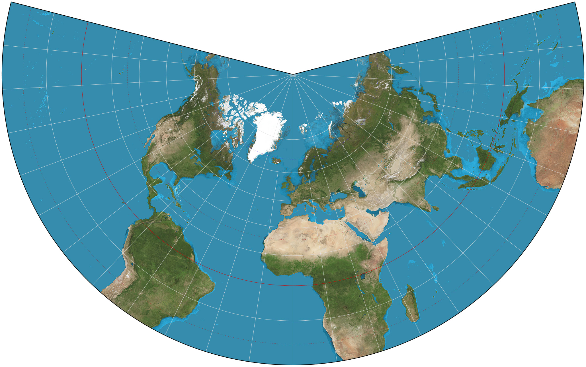
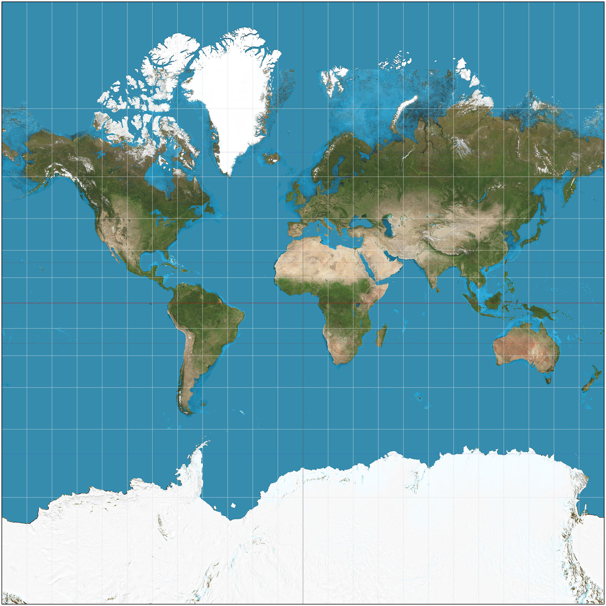

# Projections

## Summary

|                   | Lambert                                            | Mercator                                            | Polar Stereographic         |
| ----------------- | -------------------------------------------------- | --------------------------------------------------- | --------------------------- |
|                   |  |  |                             |
| Projection type   | Conical                                            | Cylindrical                                         | Polar Stereographic         |
| Graticule         | Rectangular                                        | -                                                   |                             |
| Meridians         | Vertical straight lines                            | Polar Radial straight lines                         | Polar Radial straight lines |
| Parallels         | Horizontal straight lines                          | Polar Concentric arcs                               | Pollar concentric circles   |
| Great Circles     |                                            |                                                     |                             |
| Rhumb Lines       | Straight Lines                                     | Concave to the GC line   Convex to the equator   |                             |
| Chart Convergence | No convergence!                                    |                                                     | Constnat across chart       |

## Questions

<Question
  id="5lP2OUn2hW"
  variant="definition"
  lo={["061.04.02.04.01", "061.04.02.03.01", "061.04.02.02.01"]}
  explanation="## Summary"
>
  <Text variant="oneCorrect">
    Which of the following correctly describes a <Subject /> chart?
  </Text>
  <Option id="5lP2OUn2hW-1" key="1" subject={["Mercator"]} why="">
    A cylindrical projection with the plane tangential to the equator
  </Option>
  <Option id="5lP2OUn2hW-2" key="1" subject={["Mercator"]} why="">
    A cylindrical projection, but is in fact mathematically produced
  </Option>
  <Option id="5lP2OUn2hW-3" key="1" subject={["Mercator"]} why="">
    A cylindrical projection, made using a single straight line which is tangent
    to the equator
  </Option>
  <Option id="5lP2OUn2hW-4" subject={["Lambert"]} why="">
    A conical projection that "cust the earth" at two standard parallels.
  </Option>
  <Option
    id="5lP2OUn2hW-5"
    why="Closely describes a Mercator projection, but A single straight line is used, not multiple"
  >
    A cylindrical projection, made using straight lines which are tangent to the
    equator
  </Option>
  <Option
    id="5lP2OUn2hW-6"
    why="Closely describes a Lambert projection, but two standard parallels are cut, not one."
  >
    A conical projection that "cust the earth" at a single standard parallel.
  </Option>
</Question>

<Question
  id="5lP2OUW2hW"
  variant="definition"
  lo={["061.04.02.04.01", "061.04.02.03.01", "061.04.02.02.01"]}
  explanation="## Summary"
>
  <Text variant="oneCorrect">
    <Subject /> are...
  </Text>
  <Option
    id="5lP2OUW2hW-1"
    subject={["Parallels of latitude on a Direct Mercator Chart"]}
  >
    Parallel straight lines unequally spaced
  </Option>
  <Option
    id="5lP2OUW2hW-2"
    subject={["Parallels of latitude on a Direct Mercator Chart"]}
  >
    Parallel horizontal lines unequally spaced
  </Option>
  <Option
    id="5lP2OUW2hW-3"
    subject={["Parallels of latitude on a Conformal Lambert Chart"]}
  >
    Parallel straight lines unequally spaced
  </Option>
  <Option
    id="5lP2OUW2hW-4"
    subject={["Meridians on a Conformal Lambert Chart"]}
  >
    Parallel straight lines equally spaced
  </Option>
  <Option id="5lP2OUW2hW-5" subject={["Parallels on a Direct Mercator Chart"]}>
    Concentric arcs with their center at the closest pole.
  </Option>
  <Option
    id="5lP2OUW2hW-6"
    subject={[
      "Meridians on a Direct Mercator Chart",
      "Meridians on a Polar Stereographic Chart",
    ]}
  >
    Radial straight lines radiating from the closest pole.
  </Option>
  <Option
    id="5lP2OUW2hW-7"
    subject={["Parallels on a Polar Stereographic Chart"]}
  >
    Concentric circles with their center at the closest pole.
  </Option>
</Question>
